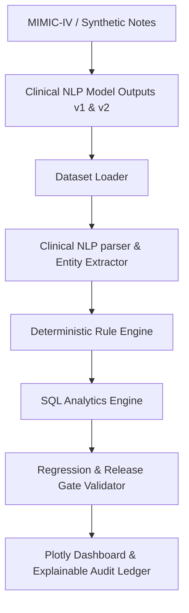

# Product Requirement Document (PRD)

## 1. Problem Statement & Objectives
Clinical Natural Language Processing (NLP) models are increasingly used to automate medical coding (ICD-10, CPT, modifiers, and HCC risk adjustments) from clinical notes. However, LLM prompt tuning, model upgrades, and software releases introduce regression risks:
- Missing diagnoses causing under-billing or lost HCC risk adjustments.
- Over-coding (e.g., E/M level upgrades or unsupported codes) leading to severe compliance and audit liabilities.
- Unit confusion in dosages (e.g., matching `mg` instead of `mcg`) affecting clinical safety verification.
- Code drift across model versions, causing silent systemic degradation.

**SynapseAudit** is an offline deterministic validation and regression engine that serves as a quality assurance gate for clinical NLP outputs. It allows compliance officers and ML engineers to compare new prompts or models against a human-adjudicated gold-standard truth set, run deterministic compliance rules, visualize code drift, and enforce release gates before models are deployed.

## 2. Key Terminology & Metrics

### Precision, Recall, and F1 Score
Computed for ICD-10 and CPT codes globally and per-specialty:
$$\text{Precision} = \frac{TP}{TP + FP}, \quad \text{Recall} = \frac{TP}{TP + FN}, \quad F_1 = 2 \cdot \frac{\text{Precision} \cdot \text{Recall}}{\text{Precision} + \text{Recall}}$$

### Cohen’s Kappa ($\kappa$)
Measures agreement between the model and the human coder, adjusted for chance agreement:
$$\kappa = \frac{p_o - p_e}{1 - p_e}$$
where $p_o$ is the relative observed agreement, and $p_e$ is the hypothetical probability of chance agreement.

### Claim Deniability Risk Index (CDRI)
An index reflecting how likely a claim is to be denied due to overcoding or coding conflicts (e.g., NCCI violations or invalid modifier usages).
$$\text{CDRI} = \frac{\text{Records with NCCI conflicts or Wrong Modifier} \times 1.5 + \text{Overcoded E/M Records}}{\text{Total Records}}$$

### HCC Capture Rate
Percentage of gold-standard Hierarchical Condition Categories (HCCs) correctly captured by the model.

## 3. System Architecture & Requirements

### Functional Requirements
1. **Clinical Entity Extractor & Text Parser**: Match ICD-10/CPT descriptors and verify context (dosage units, E/M levels). Save start/end index spans for explainable highlighting.
2. **Deterministic Rules Engine**:
   - **Modifier 25 Eligibility**: If an E/M code (e.g., 99213) and a procedure code are both present, ensure a modifier (25) is attached to the E/M code only if documented separately.
   - **NCCI Conflicts**: Prevent billing mutually exclusive codes on the same date.
   - **Unit Mismatch**: Flag when the note indicates one unit (e.g., `mcg`) but the predicted code metadata matches another (e.g., `mg`).
   - **HCC Documentation Gap**: Flag when a chronic condition (e.g., Diabetes E11.9) is in the note but missing from predictions.
3. **PostgreSQL Compliance Analytics**: Generate reports showing error rate by family, risk index, and code drift.
4. **Interactive Audit Ledger**: Present highlighting of clinical text showing exactly where codes were matched (evidence-span highlighting).
5. **Release Gates**: Hard check to prevent regressions in exact-match, modifier accuracy, or HCC capture.

## 4. Non-Goals
- **Live Billing Integration**: This is a staging/QA engine, not a live claim scrubber.
- **Real-time Clinical Intervention**: SynapseAudit runs asynchronously on batch regression datasets.
